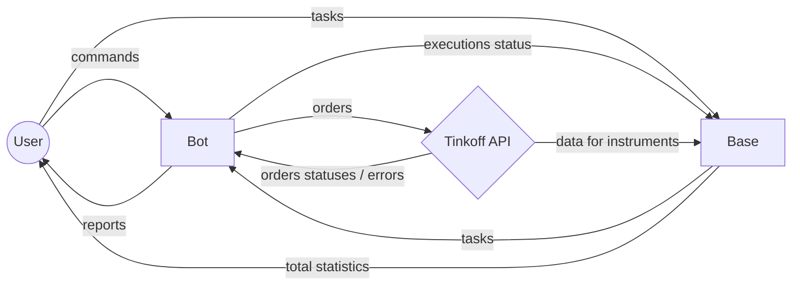

# Trademan

## About this project

Asynchronous Python trading helper for Tinkoff clients with a Django backend. A pet-project started while learning Python @ Yandex.Practicum to improve programming skills, learn asynchronous programming and help me to:
- Buy or sell stocks / futures at better prices without hassle
- Improve MOEX (Moscow Stock Exchange) functionality available at Tinkoff Investments, making it possible to create market-neutral positions: calendar spreads featuring a future as a far leg and future or stock as a near leg. Wait for a desired price and start placing orders.
- Automate routine tasks like placing alot of stop-like orders to buy stocks when the market crashes or cancel many orders at maximum speed.

This product is provided as is, it's a educational product, use it at your own risk and be sure to check the working logic, as it works with real assets on your broker account. 

I use it on a Raspberry Pi, which adds some complications to find a working combination of OS image and Python version that works with all dependencies on ARMv7 architecture, bear with it - some instructions in Dockerfiles might seem too complicated and excessive, but it's working this way and it's easier to run/stop a container stack via Portainer web-interface then to run virtual environments for both front- and backend.

This is already the 3rd iteration of the product and it's under heavy development - I'm learning through constant refactoring, it's a pretty painful, but working strategy.

Despite the fact that this is an English-language portfolio, the product itself will not be translated to English, because you have to speak Russian in order to use Tinkoff Broker.

_This is not a trading robot, but a helper to get better prices and execute safe (market neutral) strategies. It doesn't require a server on M1, fast-speed connection, etc._

## How it works - from a flight view perspective

The project consists of two separate entities:
- **Bot** if a frontend interface for users, it takes the commands, executes them and reports on execution status and possible errors. It uses **Base's** API to load configurations and update execution statuses there. The code is in the _bot_ directory.
- **Base** is a database. It holds the information about current tasks for the bot, updates FIGI information from the Tinkoff API, and also provides a web-interface to place new instructions for the bot. If features a RESTful API which the **bot** uses to communicate.

To put it simple, here's a diagram. In order to not overcomplicate it, I've skipped diffent interfaces for human and service interactions between the entities, but be aware that, as a rule of thumb humans communicate with services via telegram messages or web interface, services communicate with each user with jsons.



Basically, you set up what you want the robot to do in the web-interface. Then you send the bot a telegram command, he reads data from the base server and starts executing it.

Bot and Base can be placed on different servers, but the Bot checks if the Base is alive and will refuse to function if it's down (and will send you a message about it).

## Supported bot comands.

Although you might see more Bot commands in the source code, here's the list of thoroughly tested ones and currently supported:

- **/sellbuy** - process all sell/buy orders in the queue immediately - check for current bids and offers and place an order in the right direction at the current best bid or offer. The execution status is cached, when it changes, the bot reports User and updates the database.
- **/spreads**
- **/sprices**
- **/stops**
- **/shorts**
- **/stop**
- **/cancel**
- **/tasks**

## Installation

### Prerequisites

Make sure you have a working installation of **Python3.9** on your machine. This version is used to maket it compatible with the latest Raspberry Pi OS build, for python 3.10 some _asyncio_ commands (creating a loop) work a bit different. Also, for a Raspberry Pi you will need working installations of _docker_ and _docker-compose_.

### Acquiring credencials

You will need to get the following tokens:
- Tinkoff API **Readonly** and **Full-access** tokens. Instructions: https://tinkoff.github.io/investAPI/token/
- Telegram Bot token: in your telegram app contact @**BotFather**, issue a _/newbot_ command and follow the instructions untill you get the token. The instruction is here: https://core.telegram.org/bots/features#creating-a-new-bot .
- You will also need to know your chat id and telegram id. The former can be found upon contacting @**getmy_id** bot and telling him _/start_
- Finally, you will need the ID of your Tinkoff Investments account. When you already have the tokens, you can get a list of your accounts via API and choose the right one. Instructions: https://tinkoff.github.io/investAPI/users/#getaccounts .

Proceed when you've got all 5 artifacts, as each one is vital to the code :)

### Installation on a pc / server

Here're the instructions, assuming you'll be running both services on the same computer for testing purposes.

```
git clone https://github.com/holohup/trademan-1.0-alpha-public.git && cd trademan-1.0-alpha-public
```

### First steps: setup, first launch and testing

- Fill in the _.env.sample_ files in _/bot_ and _/trademan_ folders, remove the extensions.
- Edit the _trademan/trademan/settings.py_ file: if your server IP will be different from _127.0.0.1_, add it's address to ALLOWED_HOSTS
- Edit the _bot/settings.py_ file: replace the ENDPOINT_HOST IP with the one you used in the previous step

### Installation on a Raspberry Pi via docker-compose

- Fill in both Dockerfiles in _/bot_ and _/trademan_ folders with your creditencials
- Fill the required fields in the _settings.py_ files in both folders, just like when installing the project to a pc / server.
- Execute the docker-compose command from the root project folder:

```
docker-compose up -d
```


### A deeper dive into project settings

## Plans for the future

### Global

- Refactor using Martin's Clean Code principles
- Add average execution prices for **/sellbuy**
- Separate trading schedule for futures on MOEX
- Implement various stop-type order types for **/restore** command to become fully usable
- Test coverage for all aspects, including Decimal - Float - MoneyValue conversions and Decimal initializations
- Implement current margin amounts before starting new trade jobs, with Telegram warnings.
- Implement a **/status** command which returns a Telegram reply with the current status for each currently active command.
- Django - validate extra fields like API-trading availability before reporting active tasks to the bot.
- Ability to modify orders via bot commands, not through the web-interface.
- Add **/stops** command support for bonds.


### Quick fixes and bugs
- Add a bot command to restart django and to reload data from Tinkoff API (at the moment the management commands are ready, just need to link them to the bot)
- Redirect all logs to files
- Add 1 minute pause before **/sellbuy** reactivation on ratelimit_reset error
- Django validation for multiplicity of orders amounts to minimum lots
- Better (more intuitive) caching for **/spreads** and **/sellbuy**: use NamedTuples instead of dictionaries.
- Add _None_ for **/tasks** if no tasks are currently running.
