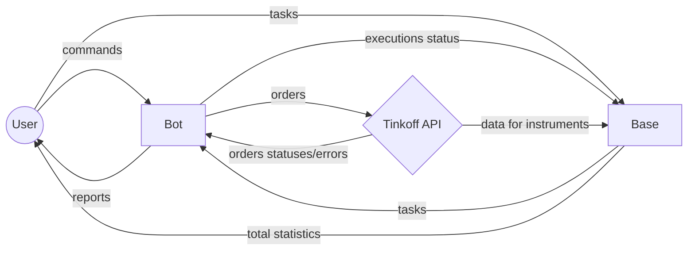

[](https://www.djangoproject.com/)
[](https://www.django-rest-framework.org/)
[](https://www.python.org/downloads/release/python-390/)
[](https://www.docker.com/)
[](https://github.com/features/actions)

# Trademan

## About this project

Asynchronous Python trading helper for Tinkoff Invest clients with a Django backend. A pet project started while learning Python @ Yandex.Practicum to improve programming skills, learn asynchronous programming and help me to:
- Buy or sell stocks/futures at better prices without the hassle
- Improve MOEX (Moscow Stock Exchange) functionality available at Tinkoff Investments, making it possible to create market-neutral positions: calendar spreads featuring a future as a far leg and a future or stock as a near leg. Wait for the desired price and start placing orders.
- Automate routine tasks like placing a lot of stop-like orders to buy stocks when the market crashes or cancel any amount of orders at maximum speed.

This product is provided as is, it's an educational product, use it at your own risk, and be sure to check the working logic, as it works with real assets on your broker account. 

I use it on a Raspberry Pi, which adds some complications to find a working combination of OS image and Python version that works with all dependencies on ARMv7 architecture, bear with it - some instructions in Dockerfiles might seem too complicated and excessive, but it's working this way and it's easier to run/stop a container stack via Portainer web-interface then to run virtual environments for both front- and backend.

This is already the 3rd iteration of the product and it's under heavy development - I'm learning through constant refactoring, it's a pretty painful, but working strategy.

Even though this is an English-language portfolio, the product itself will not be translated into English, because you have to speak Russian to use Tinkoff Broker.

_This is not a trading robot, but a helper to get better prices and execute safe (market-neutral) strategies. It doesn't require a server on M1, a fast-speed connection, etc._

### Technology stack

- Python 3.9, Django 2.2.19, Django Rest Framework 3.12.4, Asyncio, AIogram 2.22.1, Tinkoff Investments SDK 0.2.0b36

## How it works - from a flight view perspective

The project consists of two separate entities:
- **Bot** is a frontend interface for users, it takes the commands, executes them, and reports on execution status and possible errors. It uses **Base's** API to load configurations and update execution statuses there. The code is in the _bot_ directory.
- **Base** is a database. It holds the information about current tasks for the bot, updates FIGI information from the Tinkoff API, and also provides a web interface to place new instructions for the bot. It features a RESTful API which the **bot** uses to communicate.

To make it easier to comprehend, here's a diagram. To not overcomplicate it, I've skipped different interfaces for human and service interactions between the entities, but be aware that, as a rule of thumb humans communicate with services via telegram messages or web interface, while services communicate with each user using JSONs.



You set up what you want the robot to do in the web interface. Then you send the bot a telegram command, he reads data from the base server and starts executing it.

Bot and Base can be placed on different servers, but the Bot checks if the Base is alive and will refuse to function if it's down (and will send you a message about it).

## Installation

### Prerequisites

Make sure you have a working installation of **Python3.9** on your machine. This version is used to make it compatible with the latest Raspberry Pi OS build, for python 3.10 some _asyncio_ commands (creating a loop) work a bit differently. Also, for a Raspberry Pi, you will need working installations of **_docker_** and **_docker-compose_**.

### 1. Acquiring credentials

You will need to get the following tokens:
- Tinkoff API **Readonly** and **Full-access** tokens. Instructions: https://tinkoff.github.io/investAPI/token/
- Telegram Bot token: in your telegram app contact @**BotFather**, issue a _/newbot_ command and follow the instructions until you get the token. The instruction is here: https://core.telegram.org/bots/features#creating-a-new-bot.
- You will also need to know your chat id and telegram id. The former can be found upon contacting @**getmy_id** bot and telling him _/start_
- Finally, you will need the ID of your Tinkoff Investments account. When you already have the tokens, you can get a list of your accounts via API and choose the right one. Instructions: https://tinkoff.github.io/investAPI/users/#getaccounts.

Proceed when you've got all 5 artifacts, as each one is vital to the code :)

### 2. Installation on a pc / server

Here're the instructions, assuming you'll be running both services on the same computer for testing purposes.

```
git clone https://github.com/holohup/trademan-1.0-alpha-public.git && cd trademan-1.0-alpha-public
```

### 3. First steps: setup, first launch

- 3a. Fill in the _.env.sample_ files in _/bot_ and _/trademan_ folders, and remove the extensions.
- 3b. Edit the _trademan/trademan/settings.py_ file: if your server IP will be different from _127.0.0.1_, add it's address to ALLOWED_HOSTS
- 3c. Edit the _bot/settings.py_ file: replace the ENDPOINT_HOST IP with the one you used in the previous step
- 3d. From the project root directory execute the following instructions (in any order):
```
cd bot && python3.9 -m venv venv && source venv/bin/activate && pip install -r requirements.txt && deactivate && cd ..
```
```
cd trademan && python3.9 -m venv venv && source venv/bin/activate && pip install -r requirements.txt && python manage.py migrate && deactivate && cd ..
```
You have just created two separate virtual environments and installed the dependencies required to run the code!
- 3e. Finally, launch two terminals, and execute the following scripts in each from the root project folder:

```
cd trademan && source venv/bin/activate && python manage.py runserver
```
```
cd bot && source venv/bin/activate && python main.py
```

If everything went according to plan, the project has been launched! Congratulations!

### Installation on a Raspberry Pi via docker-compose

- Complete all steps up to **3c**. The only difference is that you can't specify _127.0.0.1_ as the server address, since the bot container will think it's his IP. Choose an address in your internal network (Something like 192.168.0.15)
- Execute the docker-compose command from the root project folder:

```
docker-compose up -d
```
- Change the permissions for the _/trademan_ folder so that the container would be able to write to the database and apply the migrations:
```
chmod 757 trademan && docker-compose exec web python manage.py migrate
```
- Finally, restart the containers:
```
docker-compose down && docker-compose up -d
```
### How to check if everything's working

- Issue a health check command **/test** to the bot. If everything is working the bot will ping the server health check endpoint and will message you with 'True' if everything's ok (and will also say something stupid - he's just a bot after all!).
- Use your browser to check that the API endpoints are available: go to http://127.0.0.1:8000/api/v1/
- Time to dig deeper. Stop the web server, create a superuser and issue a management command to download and parse the latest FIGI data from Tinkoff API to the database. It's done daily using middleware, but initially, the command can be run once to speed up the process.
```
python manage.py createsuperuser
```
```
python manage.py update
```
```
python manage.py runserver
```
- Now, go to http://127.0.0.1:8000/admin/ (or your IP address and port) using the superuser requisites and go to Base -> Figis. There should be around 600 entries in the database. 
- As of now, we have checked that the bot can connect to the base and that the base can connect to Tinkoff API. Our last check needs to show that the bot can connect to the API too. In your web browser go to http://127.0.0.1:8000/admin/base/spread/ -> Add Spread and add a spread. Since we're testing, it can contain anything: for example:
> [v] Active
>
> [ ] Sell
>
> Amount: 1
>
> Executed: 0
>
> Far leg: GZZ4 (Gazprom 2024 December Future)
>
> Near leg: GAZP (Gazprom stock)
>
> Spread price: 0
>
> Avg. execution price: 0
>
And save it.
- Now issue a command to the bot: **/sprices** . It should return the current spread price if it's the exchange working time, or error and a price of zero if the stock exchange is closed now.

### A deeper dive into project settings

- _trademan/trademan/settings.py_:
> **'COERCE_DECIMAL_TO_STRING': True** is needed for correct Decimal numbers initialization.
- _bot/settings.py_:
> **WORK_HOURS**: stock exchange working time in a human-readable format, the information was taken from http://moex.com website.
>
> **TIME_OFFSET = timedelta(seconds=30)**: The operations will not start before 30 seconds have passed after the session has opened and will stop 30 seconds before the session is closed. Sometimes upon the session open Tinkoff API doesn't show bids/asks.
>
> **LONG_LEVELS, SHORT_LEVELS, STOPS_SUM**: Levels and sum (in rubles) at which to place orders for **/shorts** and **/stops** commands.
>
> **SLEEP_PAUSE**: pause between cycles in **/speads** / **/sellbuy** commands. The default is 1 second.

## Supported bot commands.

Although you might see more Bot commands in the source code, here's the list of thoroughly tested and currently supported ones:

- **/sellbuy** - process all sell/buy orders in the queue immediately - check for current bids and offers and place an order in the right direction at the current best bid or offer. The execution status is cached, when it changes, the bot reports to the User and updates the database.
- **/sell or /buy [ticker] [sum] or [amount] [ticker]** - sell or buy an asset with the corresponding ticker for [sum] rubles, or [amount] amount using the *sellbuy* mechanism.
- **/dump [ticker]** - dump the position from a portfolio using the *sellbuy* mechanism. If the position is negative, it will be bought.
- **/spreads** - starts a monitoring process of active spreads in the desired direction. Whenever the suitable combination of bids/asks on both assets is achieved, it places an order on the far leg of the spread and starts monitoring its execution. Upon the execution, it places market orders on the near leg to even the amount and makes the position market-neutral, and reports to the user how many orders have already been executed. If the prices change and no longer suit the desired price, the order is removed and the monitoring continues. This command automatically counts the _far leg amount/near leg amount_ ratio based on the asset type. When the desired position is acquired, the User gets one final report and the monitoring it stopped. Like */sellbuy*, asynchronously works with multiple orders simultaneously.
- **/sprices** - gets a list of active calendar spreads from **Base** and returns current prices as if you were to buy/sell them ASAP
- **/stops** - gets a blacklist and a whitelist of desired tickers from the **Base** and puts stop orders at levels described in the _settings.py_ file and the sum of money from there. Orders are placed only for stocks present in the whitelist and absent in the blacklist. When the market crashes, some stocks sometimes stay at low levels just for a second or two. This command helps to capture good prices. Active stop orders do not eat margin requirements, making it possible to place hundreds of orders like this at the same time. When the command meets the API RPS limitation, it waits till the end of the minute and continues. The default levels for stop orders are *-15%, -20%, and -25%* from the current price. 
- **/shorts** - same as **/stops**, except it places stop-orders to sell, not to buy. Usable when there's euphoria on a market, but very dangerous - if you do not have the stocks for which you place orders, the broker will open a margin-consuming short position with potentially unlimited losses!
- **/stop** - stops all currently running tasks
- **/cancel** - cancels all active orders, including stop-orders
- **/tasks** - returns currently running tasks
- **/nuke [ticker] [sum]** - places stop orders for the ticker, splitting sum into four: current price, 99% of current price, 95% of current price and 93% of current price, like in Art Cashin's formula
- **/stash** and **/restore** - stashes active stop orders to the database and restores them. Needed in case you urgently need to cancel everything and don't want to loose your precious stop orders parameters. The commands clean up before saving or restoring stops, only one stash is available.
- **/scan (rate)** - scans all the pairs of stock-future and future-future (available for trading) and returns the most profitable ones (the profit is normalized to yearly %, is counted upon the required margin to do the trade). Due to the message limits doesn't return more then 70 top profitable pairs. Rate is an optional parameter (the default rate is currently 7.5%).
- **/tasks** - returns the list of currently running tasks.

## Plans for the future

### Global

- Refactor using Martin's Clean Code principles
- ~~Add average execution prices for **/sellbuy**~~
- ~~Separate trading schedule for futures on MOEX~~
- ~~Implement various stop-type order types for **/restore** command to become fully usable~~
- ~~Test coverage for all aspects, including Decimal - Float - MoneyValue conversions and Decimal initializations~~
- Implement current margin amounts before starting new trade jobs, with Telegram warnings.
- Implement a **/status** command which returns a Telegram reply with the current status for each currently active command.
- Django - validate extra fields like API-trading availability before reporting active tasks to the bot.
- Ability to modify orders via bot commands, not through the web interface.
- Add **/stops** command support for bonds.


### Quick fixes and bugs
- Add a bot command to restart Django and to reload data from Tinkoff API (at the moment the management commands are ready, just need to link them to the bot)
- Redirect all logs to files
- ~~Add a pause before **/sellbuy** reactivation on ratelimit_reset error~~
- Django validation for a multiplicity of orders amounts to minimum lots
- ~~Better (more intuitive) caching for **/spreads** and **/sellbuy**: use NamedTuples instead of dictionaries.~~
- ~~Add _None_ for **/tasks** if no tasks are currently running.~~
- ~~Remove ONDELETECASCADE in models if the Tinkoff API doesn't return a FIGI, instead, make it inactive, since Tinkoff's API sometimes glitches.~~
- ~~Create a command for Art Cashin's formula (0, 1, 5, 7% down) in case of a nuclear apocalypse.~~
- ~~Make a separate health check command, and reserve _/test_ for testing as it was planned.~~
